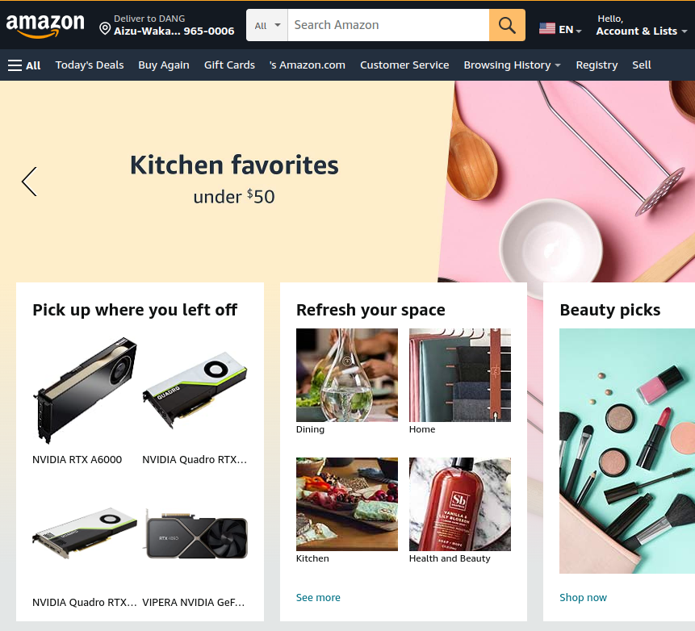

## Introduction
This repo is about how to crawl data from [Amazon Today's Deals](https://www.amazon.com/gp/goldbox)



## How-to Guide
```shell
conda activate crawler
pip install -r requirements.txt
python main.py
```
The crawled data will be stored in the `data` directory

